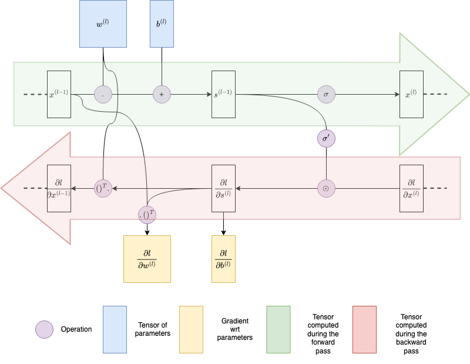

# Artificial Neural Network

Implementation of an artificial neural network with the following modules:
* Fully connected layer in `layers.py`
* ReLU activation function in `activation_fcts.py`
* Cross-entropy loss in `losses.py`

These elements are assembled via the `class Sequential()` to form the neural net:

`Sequential(
            Linear(n_features, n_hidden),
            ReLU(),
            Linear(n_hidden, n_hidden),
            ReLU(),
            Linear(n_hidden, n_hidden),
            ReLU(),
            Linear(n_hidden, n_label),
           )`

The weights are optimized by backpropagation through the optimizer using a mini-batch SGD with momentum (see `optimizer.py`)

The following hyper-parameters can be optimized in `hyperparam_tuning.py`:
* n_epochs
* n_hidden
* batch_size
* lr
* momentum

The Dataset used are the [mushroom](https://archive.ics.uci.edu/ml/datasets/Mushroom) and [white wine](https://archive.ics.uci.edu/ml/datasets/Wine+Quality) datasets 

